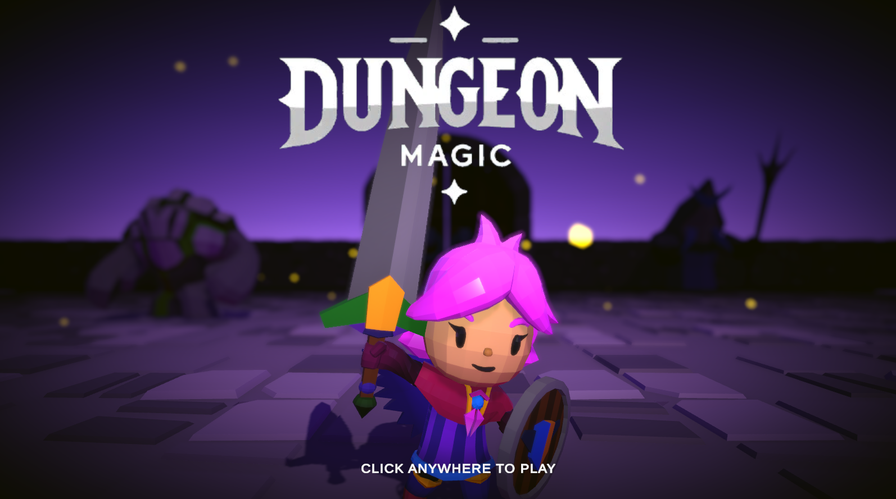
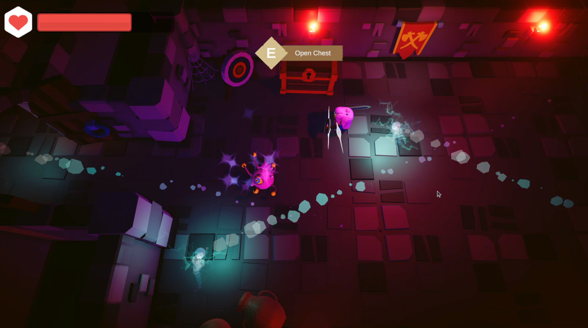
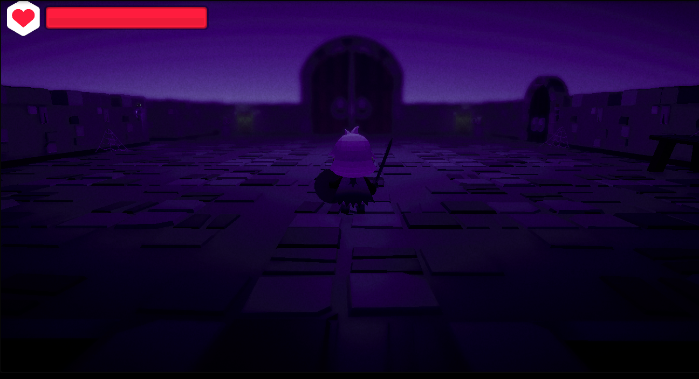
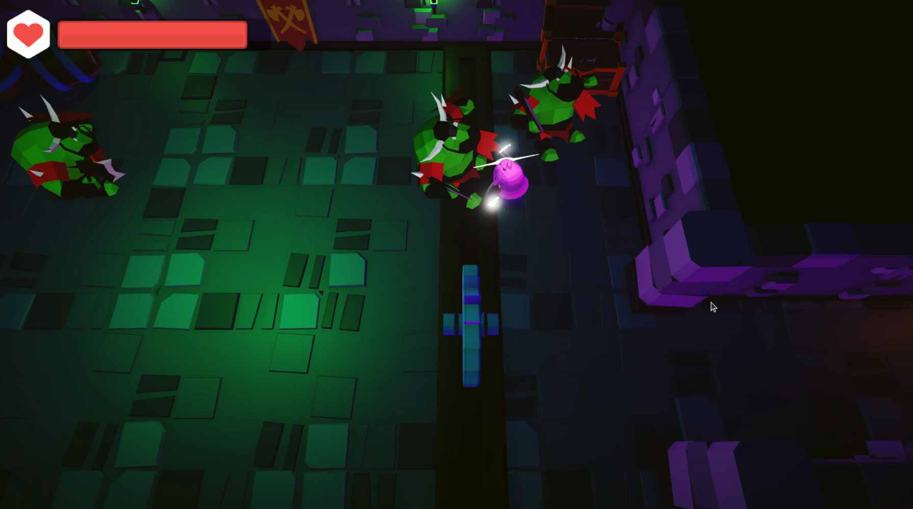
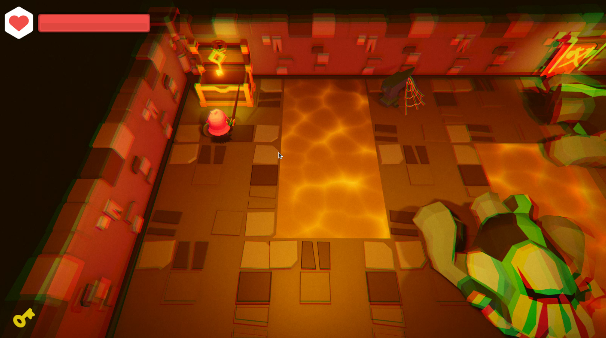
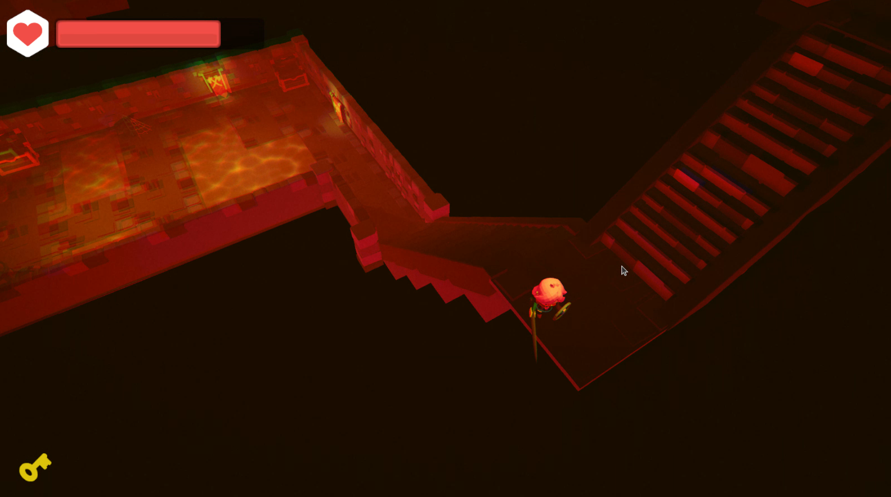
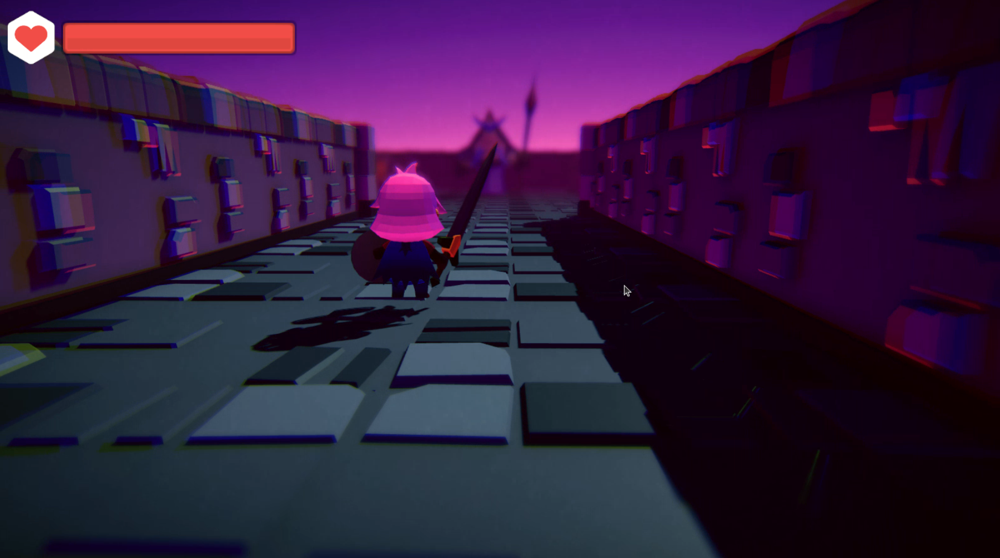
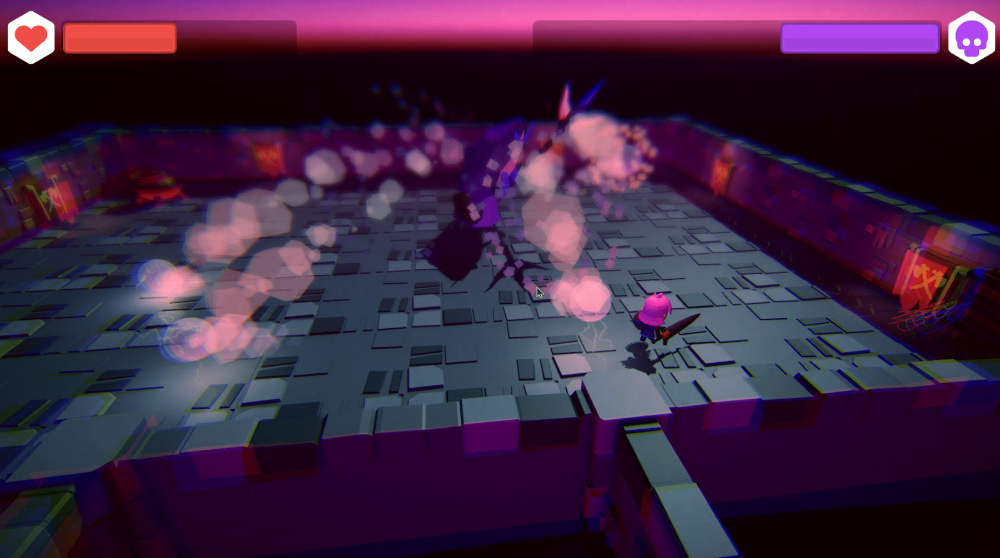

# Dungeon Magic

## Sobre o projeto

Este projeto foi desenvolvido com o principal objetivo de explorar e aprender as funcionalidades do Unity, uma das ferramentas mais poderosas para criação de jogos. Durante o desenvolvimento, além de compreender e implementar mecânicas fundamentais que formam a base de muitos jogos modernos, o projeto proporcionou uma experiência prática em diversos aspectos do desenvolvimento de jogos, como a configuração de sistemas de iluminação para criar ambientes imersivos, a aplicação de física para simular interações realistas e o uso de animações para dar vida aos personagens e objetos.

**Jogue agora em:** [DungeonMagic](https://play.unity.com/en/games/d0750e65-a8ac-476d-8987-3077ec531299/dungeon-magic)

## Tecnologias utilizadas
 

## Assets

Os assets utilizados neste projeto podem ser facilmente integrados ao seu próprio projeto. Para isso, basta fazer o download diretamente da Asset Store:

- [**RPG Tiny Hero Duo PBR Polyart** _por Dungeon Mason_](https://assetstore.unity.com/packages/3d/characters/humanoids/rpg-tiny-hero-duo-pbr-polyart-225148)
- [**RPG Monster Duo PBR Polyart** _por Dungeon Mason_](https://assetstore.unity.com/packages/3d/characters/creatures/rpg-monster-duo-pbr-polyart-157762)
- [**RPG Monster Partners PBR Polyart** _por Dungeon Mason_](https://assetstore.unity.com/packages/3d/characters/creatures/rpg-monster-partners-pbr-polyart-168251)
- [**Mini Legion Rock Golem PBR HP Polyart** _por Dungeon Mason_](https://assetstore.unity.com/packages/3d/characters/humanoids/fantasy/mini-legion-rock-golem-pbr-hp-polyart-94707)
- [**Mini Legion Lich PBR HP Polyart** _por Dungeon Mason_](https://assetstore.unity.com/packages/3d/characters/humanoids/fantasy/mini-legion-lich-pbr-hp-polyart-91497)
- [**Mini Legion Grunt PBR HP Polyart** _por Dungeon Mason_](https://assetstore.unity.com/packages/3d/characters/humanoids/fantasy/mini-legion-grunt-pbr-hp-polyart-98187)
- [**3D Dungeon Lowpoly Pack** _por CatBorg Studio_](https://assetstore.unity.com/packages/3d/props/furniture/3d-dungeon-lowpoly-pack-231265)
- [**Polygonal's Low-Poly Particle Pack** _por Polygonal Stuff_](https://assetstore.unity.com/packages/vfx/particles/polygonal-s-low-poly-particle-pack-118355)
- [**RPG Essentials Sound Effects** _por leohpaz_](https://assetstore.unity.com/packages/audio/sound-fx/rpg-essentials-sound-effects-free-227708)
- [**Hit VFX Mega Pack** _por Just Labbing_](https://assetstore.unity.com/packages/vfx/particles/hit-vfx-mega-pack-224741)
- [**Sprite Packs** _por Kenney_](https://www.kenney.nl/)
- Músicas por _Kevin MacLeod_: [incompetech.com](https://www.incompetech.com)
- Efeitos sonoros com licença pública obtidos em [freesound.org](https://freesound.org)

## Screenshots

  
  
  
  
  
  
  
  

